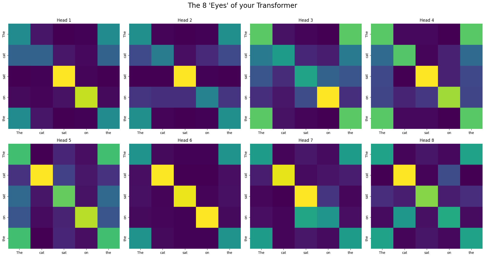

# JAX Multi-Head Transformer from Scratch
A high-performance, research-oriented implementation of the Transformer architecture built using **Google JAX** and **XLA** optimization.

## 🚀 Project Overview
This repository contains a ground-up implementation of a small character-level Transformer language model, designed to demonstrate the transition from local prototyping on **Apple Silicon (M1)** to cloud-scale training on **Nvidia A100 GPUs**. Unlike standard implementations, this project focuses on mathematical transparency and hardware-agnostic performance.

### Key Engineering Features:
* **Vectorized Multi-Head Attention:** Implemented 4-head causal attention using JAX's functional paradigm for maximum parallelization.
* **Real Text Training:** Builds a character vocabulary from `data/input.txt` and trains with next-character prediction.
* **XLA Optimized:** Leveraged Just-In-Time (JIT) compilation to fuse kernels, reducing overhead during high-dimensional matrix multiplications.
* **Hardware Agnostic:** Seamlessly switches between `Metal` (macOS) and `CUDA` (Linux/Colab) backends.
* **Interpretability Suite:** Built-in visualization tools to extract and map internal attention weights.

## 🏗 Architecture
The model follows the original *Attention is All You Need* blueprint with modern optimizations:
1.  **Embedding Layer:** Learned weight matrix for token-to-vector mapping.
2.  **Transformer Block:** * Multi-Head Self-Attention (MHA)
    * Layer Normalization (post-norm architecture)
    * Feed-Forward Network (FFN) with ReLU activation
    * Skip Connections to mitigate vanishing gradients.
3.  **Linear Head:** Final projection to vocabulary size for next-character prediction.

## 📊 Training
By default, `train.py` reads `data/input.txt`, builds a character vocabulary, trains for 100 steps, and writes a checkpoint to `checkpoints/params.pkl`. `generate.py` loads that checkpoint and samples new characters from a text prompt.

The included dataset is intentionally tiny, so generated text will look rough. To train on your own text, replace `data/input.txt` with a larger plain-text file, then run:

```bash
python train.py
python generate.py
```

### Attention Heatmap Analysis
By visualizing the attention heads, we can observe the model's internal reasoning:
* **Local Focus:** Some heads concentrate on the diagonal, learning immediate syntactic relationships.
* **Global Context:** Other heads bridge longer-range dependencies, identifying repeated tokens across the sequence.



## 🛠 How to Run
### Local Setup (macOS/Linux)
1. Clone the repo: `git clone https://github.com/vigp17/jax-transformer.git`
2. Install dependencies: `pip install -r requirements.txt`
3. Add or replace training text in `data/input.txt`
4. Run training: `python train.py`
5. Generate text: `python generate.py`
6. Run tests: `python -m pytest -q`

### Cloud Scaling
Open `notebooks/JAX_Transformer_Training_A100.ipynb` in Google Colab to run on T4/A100 GPUs.
